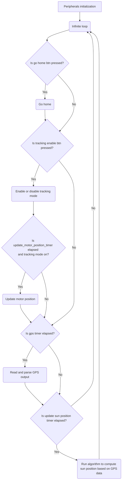

# Abstract
This is the repository for SALMO, the Solar Azimuth and eLevation Motorized lOcator. It is a PCB used for driving a tracking solar panel system, using GPS location and a MPPT algorithm to maximise the incident power.  
The official name of the project is `PPS2021_SUN_TRK`

# About the project
During the second semester of the 2021/2022 A.Y. of their bachelor degree in Electronics Engineering, a group of students known as _SALMO SOCIETY_, developed a custom board to solve real world problems. 
<br>Nowadays, we are all aware about climate change and it's impact, so the _SALMO SOCIETY_ decided in partecipate to the renewable energy run, in particular exploiting the energy obtained by a solar panel to drive a load.
<br>The aim of the board it's to move the solar panel using two step motors (along z-y axis) facilitating the MPP (Maximum Power Point) reaching and, as consequence, delivering the maximum power to the load.<br> Using a GPS module, the board knows exactly where it is located around the globe; afterwards the position of the sun is computed with a specific algorithm based on astronomical calculations. Then, the spatial position of the panel is derived by the accelerometer and compass modules; lastly, the motor is moved in order to follow the exact position of the sun (given its azimuth and elevation).


# Repo structure

    📂 SALMO_pico_fw    -> Firmware 
    📂 datasheets       -> Datasheet of every component mounted on board
    📂 kicad-project    -> KiCad and gerber files 
    
# :rainbow: Building process

Debian:

    sudo apt install cmake gcc-arm-none-eabi libnewlib-arm-none-eabi build-essential

Fedora:

    sudo dnf install cmake
    sudo dnf group install "C Development Tools and Libraries" "Development Tools"
    sudo dnf install gcc-arm-linux-gnu \
    arm-none-eabi-gcc-cs-c++ \
    arm-none-eabi-gcc-cs \
    arm-none-eabi-binutils \
    arm-none-eabi-newlib

then:

    git pull
    git submodule update --init --recursive

now add to your shell profile (`~/.bashrc` or `~/.zshrc`) the current directory (pico-sdk folder) as env variable:
 
`export PICO_SDK_PATH=<path_to>/pico-sdk`

Windows:

Follow this [guide](https://shawnhymel.com/2096/how-to-set-up-raspberry-pi-pico-c-c-toolchain-on-windows-with-vs-code/#Install_MinGW-w64_GCC_Tools) and you're good to go.

Finally, in order to compile:

    cd SALMO_pico_fw
    mkdir build
    cd build 
    cmake ..
    cd src
    make -j4

After this process some binaries files will be created. <br>The suitable one is the `.uf2` file, which is located into `SALMO_pico_fw/build/src`.<br>
Now you can start the board in bootloader mode:
1. Disconnect the board
1. Hold the `BOOTSEL` button
1. Connect the device to your computer

Then drag and drop the `.uf2` file to `RPI-RP2` mass storage device.

## Picotool
If you want to install picotool and easily flash when RP2040 is not in BOOTSEL mode, you need to follow these steps:

### Debian:

    sudo apt install build-essential pkg-config libusb-1.0-0-dev

### Fedora:

    sudo dnf install libusb-devel libusb libusb1-devel systemd-devel
    sudo reboot

### Mac:

    xcode-select --install
    brew install libusb
    brew link --overwrite libusb
    
### Windows:    
    
press the bootloader button to go in bootloader mode

    cd build
    cd src
    
then drag and drop SALMO.uf2 into the mounted microcontroller memory (mass storage device)
   
### For all version
After you have downloaded picotool you have to compile it:

    cd picotool
    mkdir build
    cd build
    cmake ..
    make

Afterwards, you must give execution permissions to the scripts:

    cd ../../SALMO_pico_fw/src
    sudo chmod +x build.sh
    sudo chmod +x flash.sh
    sudo chmod +x build_and_flash.sh

If something on MacOS doesn't work use

    sudo chown -R {username}:{workgroup} ppse-2021

Then, you can simply navigate to `SALMO_pico_fw/src/` and execute `build.sh`, `flash.sh` or `build_and_flash.sh` to respectively build, flash or build and flash the project. :nail_care:

# Firmware flow chart


# How to contribute to the project
In this sections you can find some guidelines in order in order to contribute with out project

## Commits

A good commit message should be preceded by a prefix, then a colon and then a brief and descriptive comment on the changes made.  
All commits should be written in the present simple tense (eg. add file, modify this, edit that).  
Commits may also include longer descriptions in the second argument of a commit message.

Following are the prefix conventions for this repository.

- `hw:` for hardware (schematic, pcb, ...)
- `fw:` for firmware
- `sw:` for software (interfaces on a pc and such)
- `docs:` for documentation
- `notes:` for lecture notes
- `chore:` for general tasks (file management, moving stuff around, ...)

:x: `git commit -m "Added some features to code"`  
:heavy_check_mark: `git commit -m "fw: add uart implementation to gps driver"`

## File naming

All files must have no spaces and should be lowercase.

:x: Name of file.ext  
:heavy_check_mark: name-of-file.ext 

## :briefcase: Adding new drivers or libraries
If you want to add a new driver or library please keep this tree structure
```
📦 SALMO_pico_fw
 ┣📜 CMakeLists.txt (Project cmake file)
 ┣ 📂 build
 ┣ 📂 src
 ┗ 📜 CMakeLists.txt (SALMO.C cmake file)
 ┣ 📂 your_lib
 ┃ ┗ 📂 your_lib docs
 ┃ ┗ 📜 CMakeLists.txt (lib cmake file)
 ┃ ┗ 📜 your_lib.c.
 ┃ ┗ 📜 your_lib.h
```
Every library needs some sort of documentation, and of course a cmake file!
